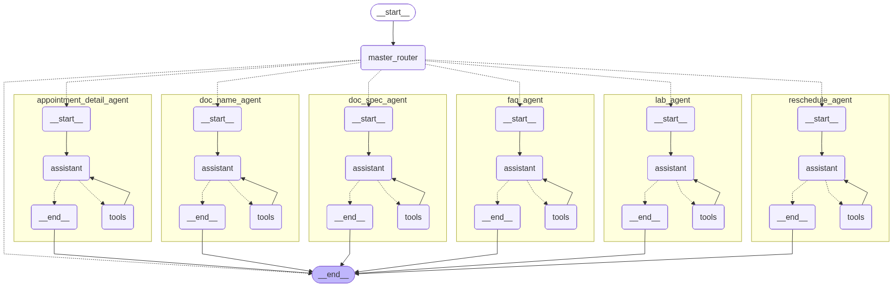
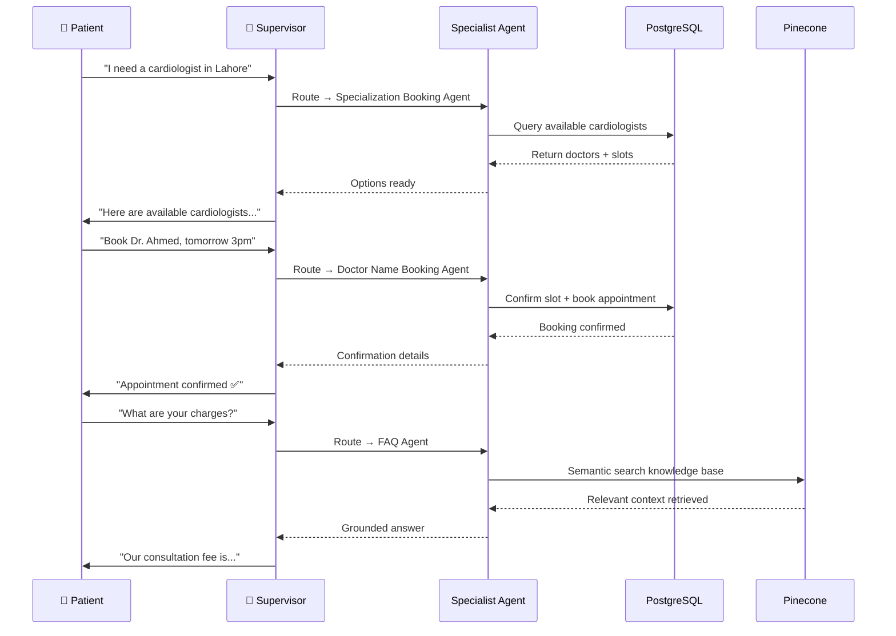

# 🤖 WhatsApp Multi-Agent Appointment Booking System

> **Production-grade LangGraph multi-agent system** — 1 supervisor 
> agent orchestrating 6 specialist subagents to fully automate patient 
> appointment booking via WhatsApp at Pakistan's largest digital 
> health platform.


---

## 📊 Production Metrics

| Metric | Value |
|--------|-------|
| Daily bookings automated | 2,000+ |
| Support workload reduction | 85% |
| Human intervention required | 0% |
| Languages supported | English · Urdu · Roman Urdu |
| Deployment | AWS · Docker · Production |

---

## 🏗️ System Architecture



---

## 🤖 Agent Design

This system implements the **LangGraph Supervisor Pattern** — a central 
supervisor classifies every incoming user message and routes it to the 
most appropriate specialist subagent dynamically.

### Agents Overview

| Agent | Responsibility |
|-------|---------------|
| 🧠 **Supervisor Agent** | Classifies intent, maintains conversation state, routes to correct subagent |
| 👨‍⚕️ **Doctor Name Booking Agent** | Books appointments by searching specific doctor name |
| 🔍 **Specialization Booking Agent** | Finds and books doctors by medical specialty and location |
| 🧪 **Lab Appointment Agent** | Handles all lab test bookings and scheduling |
| 📅 **Reschedule Agent** | Modifies, reschedules, or cancels existing appointments |
| ❓ **FAQ Agent** | Agentic RAG over healthcare knowledge base via Pinecone |
| 📍 **Appointment History Agent** | Retrieves past appointments and sends clinic location links |

---

## ⚡ Key Features

- **Supervisor Pattern Orchestration** — intelligent intent classification 
  with dynamic routing across 6 specialist agents
- **Agentic RAG** — FAQ agent uses multi-step retrieval over Pinecone 
  vector database for accurate, grounded answers
- **Human-in-the-Loop** — automatic escalation to human agents via 
  Chatwoot CRM when confidence is low or user is frustrated
- **Streaming** — real-time token streaming for faster response delivery
- **Persistence** — LangGraph checkpointing with PostgreSQL stores full 
  conversation state across sessions
- **Multilingual** — handles English, Roman Urdu, and Urdu seamlessly 
  in the same conversation
- **Location Links** — appointment history agent sends Google Maps 
  clinic location links directly in WhatsApp
- **Production Deployed** — running on AWS with Docker, handling 
  thousands of daily conversations

---

## 🔄 Conversation Flow



---

## 🛠️ Tech Stack

| Layer | Technology |
|-------|-----------|
| Agent Orchestration | LangGraph, LangChain |
| LLM | GPT-4o |
| Observability | LangSmith |
| Messaging | WhatsApp Cloud API |
| Human Escalation | Chatwoot CRM |
| Vector Database | Pinecone |
| Relational Database | PostgreSQL |
| Backend | FastAPI, Python |
| Streaming | LangGraph Streaming |
| Persistence | LangGraph Checkpointing |
| Deployment | Docker, AWS |

---

## 📁 Project Structure

```
langgraph-whatsapp-multi-agent-booking-system/
├── README.md
├── requirements.txt
├── architecture/
│   └── system-architecture.png
├── demo/
│   └── screenshots/
└── docs/
    └── agent-flow.md
```

---

## 📸 Demo

> 🎥 Demo video coming soon

---

> ⚠️ **Note:** This repository showcases the architecture and design 
> of a production system built at Oladoc. Source code is proprietary. 
> A simplified open-source demo version is in progress.

---

## 📫 Contact

**Adnan Abdullah** — Agentic AI Engineer & AI Team Lead

[](https://linkedin.com/in/adnan-abdullah-700899b)
[](mailto:muhammad.adnannust@gmail.com)

---

*Built with LangGraph · Deployed at Pakistan's largest digital 
health platform · 2,000+ daily bookings automated*
